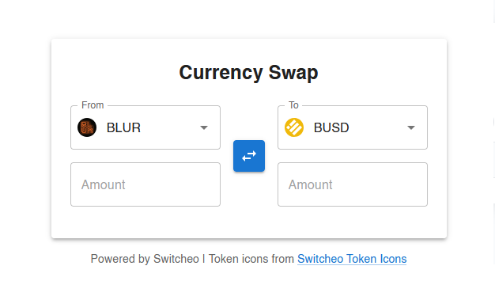

# Currency Swap Form



A modern, interactive currency swap form built with React and Vite.

## Features

- **Two-way swap:** Enter an amount in either input to calculate the other direction instantly.
- **Token selection:** Choose from available tokens with real-time prices (only tokens with valid rates are shown).
- **Token icons:** Each token is displayed with its icon for easy identification.
- **Swap direction:** Instantly swap the direction of the conversion with a single button.
- **Input validation:** Only valid numbers are accepted; both fields are editable.
- **Responsive design:** Fully responsive and center-aligned, works on all devices.
- **Attractive UI:** Card-like layout, modern look, and accessible form controls.
- **No backend required:** All price data is fetched from a public API.

## Tech Stack
- React + Vite
- TypeScript
- SCSS for styling
- Jest + React Testing Library for tests

## How to Run
1. Install dependencies:
   ```bash
   npm install
   ```
2. Start the development server:
   ```bash
   npm run dev
   ```
3. Open [http://localhost:5173](http://localhost:5173) in your browser.

## How to Test
```bash
npm test
```

---

Token icons from [Switcheo Token Icons](https://github.com/Switcheo/token-icons/tree/main/tokens).
Price data from [Switcheo Interview API](https://interview.switcheo.com/prices.json).
