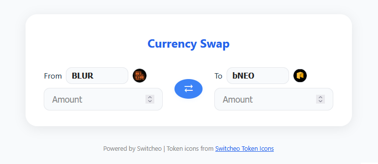

# Currency Swap Interface

A modern, responsive currency swap interface built with React, TypeScript, and Material UI.



## Features

- 🔄 Real-time currency conversion
- 🔍 Searchable token selection with autocomplete
- 💱 Live price fetching from Switcheo API
- 🎨 Modern UI with Material Design
- 📱 Fully responsive layout
- ⌨️ Keyboard navigation support
- ♿ Accessibility features
- ✅ Input validation
- 🧪 Comprehensive test coverage (>85%)

## Tech Stack

- React 18
- TypeScript
- Material UI (MUI)
- Vite
- Jest + React Testing Library
- SCSS

## Getting Started

### Prerequisites

- Node.js (v14 or higher)
- npm or yarn

### Installation

1. Clone the repository:
```bash
git clone https://github.com/phamcong/code-challenge.git
cd src/problem2
```

2. Install dependencies:
```bash
npm install
```

3. Start the development server:
```bash
npm run dev
```

The application will be available at `http://localhost:5173`

### Running Tests

```bash
npm test
```

To view test coverage:
```bash
npm run test:coverage
```

Current test coverage:
```
File               | % Stmts | % Branch | % Funcs | % Lines
-------------------|---------|----------|---------|--------
All files          |   87.77 |    78.57 |   93.33 |   87.50
 AmountInput.tsx   |     100 |       90 |     100 |     100
 App.tsx           |   81.96 |    71.87 |   85.71 |   81.35
 TokenSelector.tsx |     100 |    71.42 |     100 |     100
 utils.ts          |     100 |      100 |     100 |     100
```

## Project Structure

```
src/
├── __tests__/          # Test files
│   ├── AmountInput.test.tsx
│   ├── App.test.tsx
│   ├── TokenSelector.test.tsx
│   └── utils.test.ts
├── assets/             # Static assets
├── components/         # React components
│   ├── AmountInput.tsx
│   └── TokenSelector.tsx
├── utils.ts            # Utility functions
├── App.tsx             # Main application component
└── main.tsx            # Application entry point
```

## API Integration

The application fetches token prices from:
```
https://interview.switcheo.com/prices.json
```

Token icons are sourced from Switcheo's token-icons repository:
```
https://github.com/Switcheo/token-icons
```

## Features in Detail

### Token Selection
- Searchable dropdown with token icons
- Keyboard navigation support
- Token filtering (excludes already selected token)
- Fallback handling for missing token icons
- Error handling for invalid token data

### Amount Input
- Real-time validation
- Numeric input with decimal support
- Automatic conversion between tokens
- Responsive to price changes
- Error handling for invalid inputs

### Swap Functionality
- Instant token swap with position switching
- Maintains amount values during swap
- Real-time price calculations
- Error handling for edge cases

### Error Handling
- Graceful handling of API failures
- Input validation feedback
- Fallback UI states
- Comprehensive error state testing

### Testing
- Unit tests for all components
- Integration tests for token swapping
- Error handling test coverage
- Edge case testing
- Real-time price update testing

---

Token icons from [Switcheo Token Icons](https://github.com/Switcheo/token-icons/tree/main/tokens).
Price data from [Switcheo Interview API](https://interview.switcheo.com/prices.json).
