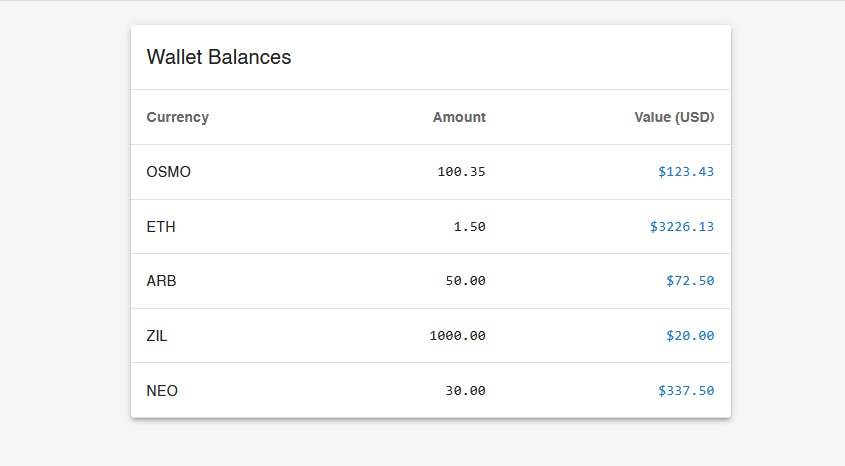

# Problem 3: React Component Refactoring

This directory contains a refactoring exercise for a React component that displays wallet balances and prices.

## Project Structure

- `messy-react.tsx` - Original component with issues
- `code-review.md` - Detailed analysis of issues and anti-patterns
- `refactored-wallet.tsx` - Improved implementation
- `hooks/` - Custom hooks for data fetching
  - `useWalletBalances.ts` - Hook for wallet balance data
  - `usePrices.ts` - Hook for price updates

## Code Review

The complete analysis of the original code's issues and anti-patterns can be found in:
[Code Review Document](./code-review.md)

Key points covered:
- Computational inefficiencies
- Type safety issues
- React best practices violations
- Performance optimizations needed
- Error handling improvements

## Viewing the Refactored Component

To run the refactored wallet component:

1. Install dependencies:
```bash
npm install
```

2. Start the development server:
```bash
npm run dev
```

3. Open your browser and navigate to:
```
http://localhost:3001
```
(or the port shown in your terminal)


## Screenshot




## Key Improvements in Refactored Version

1. **Type Safety**
   - Proper TypeScript types
   - Runtime type validation
   - Blockchain type constants

2. **Performance**
   - Memoized calculations
   - Efficient data transformations
   - Proper cleanup of resources

3. **Error Handling**
   - Graceful error recovery
   - Data validation
   - Fallback values

4. **React Best Practices**
   - Custom hooks for data fetching
   - Proper component structure
   - Material-UI integration

5. **Maintainability**
   - Clear code structure
   - Proper documentation
   - Separation of concerns 